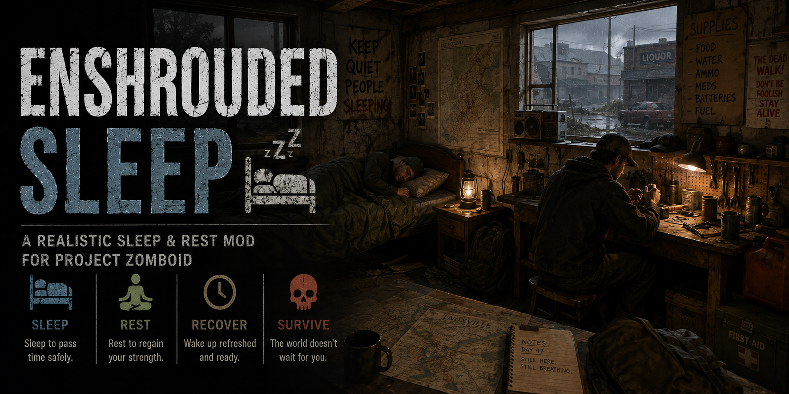

<p align="center">
  
</p>

# Enshrouded Sleep

**Proportional multiplayer sleeping for Project Zomboid Build 42 servers.**

Status: **Public Alpha**  
Current version: **v0.0.10**  
Validated Project Zomboid baseline: **42.20.3**

## Contents

- [Overview](#overview)
- [Features](#features)
- [Requirements and Compatibility](#requirements-and-compatibility)
- [Installation](#installation)
- [Configuration](#configuration)
- [How It Works](#how-it-works)
- [Known Behavior and Limitations](#known-behavior-and-limitations)
- [Diagnostics and Support](#diagnostics-and-support)
- [Documentation](#documentation)
- [License and Disclaimers](#license-and-disclaimers)
- [Documentation Index](docs/README.md)
- [License](LICENSE)

## Overview

Enshrouded Sleep is a **multiplayer-server mod** for Project Zomboid Build 42. It allows some players to sleep without requiring every living player on the server to go to bed at the same time.

When part of the living server population is asleep, the mod proportionally compresses **world/calendar time** by changing the server's `MinutesPerDay`. Awake players continue moving, fighting, driving, crafting, and interacting at normal active-simulation speed. When every living player is asleep, Enshrouded Sleep restores the native day length and lets vanilla Project Zomboid full-sleep fast-forward take over.

Local/standalone single-player gameplay is not a supported target for this project.

## Features

- Proportional partial-sleep behavior based on the fraction of living server players currently asleep.
- Server-authoritative calendar compression using `GameTime:MinutesPerDay` rather than a global simulation multiplier.
- Explicit server-to-client day-length synchronization so sleeping and awake clocks remain coherently paced.
- Exact baseline restoration when partial sleep ends.
- Vanilla full-sleep handoff when all living players are asleep.
- Runtime inheritance of the server's native day length and `FastForwardMultiplier`.
- Optional low-level diagnostics for server administrators and support investigations.
- Build 42 versioned mod structure.

## Requirements and Compatibility

Current Public Alpha validation targets Project Zomboid **42.20.3**.

Stable Project Zomboid Mod ID:

```text
pz-enshrouded-sleep
```

Enshrouded Sleep is intended for multiplayer servers. Mods that independently alter multiplayer sleep policy, `GameTime:MinutesPerDay`, clock synchronization, or sleep fast-forward may conflict and should be tested carefully before use together.

Compatibility claims are intentionally limited to configurations that have actually been tested. See [`docs/VALIDATION_HISTORY.md`](docs/VALIDATION_HISTORY.md) and [`docs/ROADMAP.md`](docs/ROADMAP.md) for the current evidence boundary and Public Alpha targets.

## Installation

### Steam Workshop

The first Steam Workshop publication has not yet been assigned a Workshop ID. After publication, server administrators will configure both the Steam Workshop item and the Project Zomboid Mod ID:

```text
WorkshopItems=<Steam Workshop ID assigned at publication>
Mods=pz-enshrouded-sleep
```

Players joining a Workshop-configured server should use the Workshop-distributed copy rather than maintaining a separate manual copy of the same mod.

### Manual client installation

The repository is structured as a Steam Workshop package. The actual deployable Project Zomboid mod is:

```text
Contents/mods/pz-enshrouded-sleep/
```

For a manual client installation, copy that **inner mod directory** to:

```text
C:\Users\<user>\Zomboid\mods\pz-enshrouded-sleep\
```

Do not copy the repository/Workshop wrapper itself into `Zomboid\mods`.

### Manual dedicated-server installation

Copy:

```text
Contents/mods/pz-enshrouded-sleep/
```

into the server's normal mod directory so the resulting path is equivalent to:

```text
mods/pz-enshrouded-sleep/
```

and configure:

```text
Mods=pz-enshrouded-sleep
```

### Workshop authoring / publication

The repository root is intentionally Workshop-package compatible:

```text
pz-enshrouded-sleep/
├── workshop.txt
├── Contents/
│   └── mods/
│       └── pz-enshrouded-sleep/
├── docs/
├── README.md
├── CHANGELOG.md
└── ...public project documentation...
```

For publication, place a clean copy of the repository contents under the Project Zomboid Workshop authoring directory shown by the game client (normally under `Zomboid\Workshop`). Do not include source-control metadata such as `.git/`, local logs, credentials, or private test artifacts.

The Steam Workshop `preview.png` and in-game mod artwork should be added before the first upload using the dimensions/requirements of the current Build 42 `ModTemplate` generated by the installed game client.

## Configuration

Public Alpha recommended configuration:

```lua
EnshroudedSleep = {
    Enabled = true,
    PartialSleepSpeedScale = 1.0,
    DiagnosticsEnabled = false,
    DiagnosticForcedCompressionFactor = 1.0,
}
```

### `Enabled`

Turns the normal Enshrouded Sleep mechanic on or off. When disabled, the controller restores the captured native `MinutesPerDay` baseline where possible.

Default:

```text
true
```

### `PartialSleepSpeedScale`

Scales the server's native `FastForwardMultiplier` for **normal partial sleep only**.

```text
1.0 = neutral; inherit the server's configured fast-forward policy
0.5 = half the normal partial-sleep compression
2.0 = double the normal partial-sleep compression
0.0 = no partial-sleep calendar compression
```

The sandbox UI currently allows values from `0.0` through `5.0`. Public Alpha deployment should begin at the validated neutral value of `1.0` unless a server administrator deliberately chooses otherwise.

### Diagnostics options

These are support/development controls, not normal gameplay tuning:

```text
DiagnosticsEnabled=false
DiagnosticForcedCompressionFactor=1.0
```

`DiagnosticsEnabled=true` enables verbose clock, sleep, health, survival-stat, nutrition, and injury telemetry and can produce large log files.

`DiagnosticForcedCompressionFactor` is a controlled server-test option used to reproduce calendar compression with exactly one connected awake player. It should remain `1.0` during normal play.

## How It Works

The authoritative server uses instantiated living players only:

```text
LivingPlayers = getOnlinePlayers() where isDead() == false
SleepingPlayers = LivingPlayers where isAsleep() == true
```

During normal partial sleep:

```text
SleepFraction = SleepingPlayers / LivingPlayers
EffectivePartialSleepCap = FastForwardMultiplier * PartialSleepSpeedScale
CalendarCompressionFactor = max(1.0,
    EffectivePartialSleepCap * SleepFraction)
EffectiveMinutesPerDay =
    BaselineMinutesPerDay / CalendarCompressionFactor
```

State policy:

```text
no living players asleep
-> native baseline MinutesPerDay

some, but not all, living players asleep
-> proportional calendar compression

all living players asleep
-> restore native baseline
-> vanilla full-sleep fast-forward owns the state
```

The mod does **not** call `GameTime:setMultiplier()` for normal partial sleep.

See [`docs/ARCHITECTURE.md`](docs/ARCHITECTURE.md) and the ADRs under [`docs/adr/`](docs/adr/) for design rationale.

## Known Behavior and Limitations

Calendar compression means genuine Project Zomboid world/calendar time is passing faster in real time. Systems driven by elapsed game-world time can therefore advance while another player sleeps. This includes known player survival-state effects such as hunger, thirst, fatigue, and nutrition, as well as potentially other world systems such as spoilage, farming, generator fuel, corpse decay, weather, and modded systems keyed to game minutes or world age.

The Public Alpha health/time-domain investigation is documented in [`docs/spikes/SPIKE-004-health-time-domains.md`](docs/spikes/SPIKE-004-health-time-domains.md). Detailed measurements and experimental evidence intentionally live there rather than in this public landing page.

Other current limitations:

- local/standalone single-player is not a supported target;
- compatibility with other time/sleep mods is not guaranteed;
- Public Alpha still needs broader 3–12+ player field testing and long-session validation;
- some uncommon pathological survival states and non-health world-time systems remain characterization targets.

## Diagnostics and Support

Verbose diagnostics are disabled by default. When troubleshooting, administrators may enable them temporarily and collect server/client logs.

Primary log prefixes include:

```text
[EnshroudedSleep]
[EnshroudedSleepSync][SERVER]
[EnshroudedSleepSync][CLIENT]
[EnshroudedSleepHealthDiag][SERVER]
[EnshroudedSleepHealthDiag][CLIENT]
[EnshroudedSleepSurvivalDiag][SERVER]
[EnshroudedSleepSurvivalDiag][CLIENT]
```

See [`docs/TESTING.md`](docs/TESTING.md) and [`docs/DEPLOYMENT.md`](docs/DEPLOYMENT.md) for diagnostic and rollback procedures.

## Documentation

- [`docs/README.md`](docs/README.md) — documentation index
- [`docs/DEPLOYMENT.md`](docs/DEPLOYMENT.md) — Public Alpha deployment, monitoring, diagnostics, and rollback
- [`docs/ROADMAP.md`](docs/ROADMAP.md) — canonical roadmap and release-stage criteria
- [`docs/ARCHITECTURE.md`](docs/ARCHITECTURE.md) — technical architecture
- [`docs/REQUIREMENTS.md`](docs/REQUIREMENTS.md) — normative MVP requirements and acceptance matrix
- [`docs/TESTING.md`](docs/TESTING.md) — smoke/regression/field-test procedures
- [`docs/VALIDATION_HISTORY.md`](docs/VALIDATION_HISTORY.md) — detailed validation chronology
- [`docs/spikes/`](docs/spikes/) — experimental investigations and results, including SPIKE-004
- [`docs/adr/`](docs/adr/) — architecture decision records
- [`docs/RELEASE_CHECKLIST.md`](docs/RELEASE_CHECKLIST.md) — release and Workshop publication gate
- [`COMPLIANCE.md`](COMPLIANCE.md) — Project Zomboid mod-policy compliance entry point
- [`CHANGELOG.md`](CHANGELOG.md) — version/change history

## License and Disclaimers

Source-code licensing is described in [`LICENSE`](LICENSE) and [`NOTICE`](NOTICE). Creative/promotional asset licensing is described separately in [`ASSET_LICENSE.md`](ASSET_LICENSE.md). Third-party provenance is tracked in [`THIRD_PARTY_NOTICES.md`](THIRD_PARTY_NOTICES.md).

**Project Zomboid / The Indie Stone:** Enshrouded Sleep is an unofficial community mod for Project Zomboid. It is not developed by, affiliated with, sponsored by, endorsed by, or otherwise official to The Indie Stone. Project Zomboid and associated intellectual property remain the property of The Indie Stone. Publication and distribution are subject to The Indie Stone's Project Zomboid Modding Policy and applicable terms.

**Enshrouded / Keen Games:** Enshrouded Sleep is also not developed by, affiliated with, sponsored by, or endorsed by Keen Games. The project name refers to the general multiplayer-sleep design inspiration associated with the game *Enshrouded*; this mod does not include or redistribute Enshrouded code, assets, or game content. *Enshrouded* and associated intellectual property remain the property of their respective rights holders.
