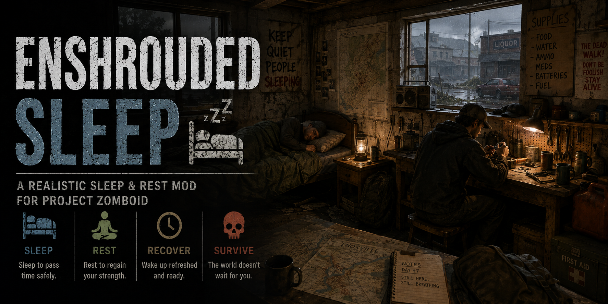

<p align="center">
  
</p>

# Enshrouded Sleep

**Proportional multiplayer sleeping for Project Zomboid Build 42 servers.**

Status: **Stable release**

Current version: **v1.0.2**

Validated Project Zomboid baseline: **42.21.0**

[](https://buymeacoffee.com/jonathanjacobs)

## What it does

Enshrouded Sleep lets part of a multiplayer server population sleep without requiring every living player to go to bed at the same time.

During partial sleep, the authoritative server accelerates world/calendar time by reducing `GameTime:MinutesPerDay`. Awake movement, combat, vehicles, animations, physics, and ordinary timed actions remain on the normal active-simulation path. When all living players are asleep, the mod restores the native day length and hands full-sleep acceleration back to vanilla Project Zomboid.

Enshrouded Sleep also protects awake living players from the extra partial-sleep acceleration of Hunger, Thirst, Fatigue, Calories, Carbohydrates, Proteins, Lipids, and Weight progression. Sleeping players remain vanilla-authoritative.

Local/standalone single-player gameplay is outside the supported scope.

## Features

- proportional partial-sleep calendar compression based on the sleeping fraction;
- server-authoritative day-length changes rather than global simulation fast-forward;
- explicit server-to-client clock pacing synchronization;
- exact baseline restoration and vanilla all-asleep handoff;
- awake-player survival protection during partial sleep;
- independent protection-disable switch for compatibility testing;
- optional concise server-chat sleep/world-time notifications, disabled by default and controlled by the server administrator;
- optional server-authoritative Rested / Well Rested rewards for qualifying sleep, disabled by default, with configurable XP and Endurance-recovery bonuses;
- self-contained Rested / Well Rested Moodle display with no external Moodle framework dependency;
- low-volume operational logging plus opt-in verbose diagnostics.

## Build 42.21.0 compatibility

Enshrouded Sleep is tested with Project Zomboid **42.21.0** (`4a0e9546ec`) on a live dedicated server. Startup, baseline capture, proportional partial sleep with awake-player protection, client clock synchronization, exact baseline restoration on wake, sleep notifications, and a Rested grant completed without an Enshrouded Sleep Lua exception. The previous checkpoint was **42.20.4** (`b0bbce05d5`).

Project Zomboid 42.20.4 removed Lua `loadstring`/`loadstream` and 42.21.0 restored them. Enshrouded Sleep uses neither. Its multiplayer synchronization and optional notification paths use predefined named `sendServerCommand` / `OnServerCommand` messages with structured arguments rather than server-supplied executable code.

Optional notifications and sleep benefits are independently disabled by default. Either can be turned off without changing proportional sleep, clock synchronization, or awake-player protection.

## Server setup

```text
WorkshopItems=3786842301
Mods=pz-enshrouded-sleep
```

Recommended defaults:

```text
EnshroudedSleep.Enabled=true
EnshroudedSleep.PartialSleepSpeedScale=1.0
EnshroudedSleep.AwakePlayerProtectionEnabled=true
EnshroudedSleep.SleepNotificationsEnabled=false
EnshroudedSleep.SleepBenefitsEnabled=false
EnshroudedSleep.DiagnosticsEnabled=false
EnshroudedSleep.DiagnosticForcedCompressionFactor=1.0
```

`SleepNotificationsEnabled=true` broadcasts short sleep-state messages such as `[Enshrouded Sleep] 1/2 living players sleeping (50%). World time is 20x faster.` whenever the effective multiplayer sleep state changes. It is an administrator-controlled presentation option only; disabling it does not change sleep policy, clock synchronization, or awake-player protection.

Option semantics are in the [configuration reference](#configuration-reference) below; the upgrade procedure and rollback are in [`docs/RELEASING.md`](docs/RELEASING.md#updating-a-server), and monitoring and diagnostic use in [`docs/TESTING.md`](docs/TESTING.md#chasing-a-problem). The in-game sandbox tooltips contain the same administrator-facing option guidance.

## Configuration reference

Administrator meaning:

- `Enabled` — master Enshrouded Sleep controller switch.
- `PartialSleepSpeedScale` — scales normal proportional partial-sleep calendar acceleration; `1.0` is neutral.
- `AwakePlayerProtectionEnabled` — protects supported awake-player survival/metabolism fields during partial sleep; disable this first when isolating a compatibility problem in the protection layer.
- `SleepNotificationsEnabled` — server-administrator switch for concise player-facing sleep-state messages. Disabled by default and has no effect on sleep/time policy, client clock synchronization, or awake-player protection.
- `SleepBenefitsEnabled` — optional Rested / Well Rested reward layer. Disabled by default; when enabled it does not change sleep eligibility or proportional time compression.
- `DiagnosticsEnabled` — enables high-volume troubleshooting telemetry; leave off during routine play.
- `DiagnosticForcedCompressionFactor` — isolated one-player regression tool; keep at `1.0` during normal multiplayer operation.

When notifications are enabled, partial-sleep messages use the settled authoritative compression factor and current living-player denominator, for example:

```text
[Enshrouded Sleep] 1/2 living players sleeping (50%). World time is 20x faster.
```

All-awake and all-asleep transitions use short special messages rather than claiming a misleading multiplier during vanilla full-sleep handoff.

The in-game sandbox tooltips contain fuller option descriptions. The canonical clock/protection/benefit behavior is in the [requirements](docs/DESIGN.md#requirements).

### Sleep-benefit configuration

Default settings:

```text
EnshroudedSleep.SleepBenefitsEnabled=false

EnshroudedSleep.RestedMinimumSleepHours=8.0
EnshroudedSleep.RestedDurationHours=4.0
EnshroudedSleep.RestedXPBonusPercent=10.0

EnshroudedSleep.WellRestedMinimumSleepHours=12.0
EnshroudedSleep.WellRestedDurationHours=6.0
EnshroudedSleep.WellRestedXPBonusPercent=10.0
EnshroudedSleep.WellRestedEnduranceRecoveryBonusPercent=10.0
```

Default classification:

```text
< 8 game hours     -> no new benefit
8 to 12 hours      -> Rested: +10% XP for 4 game hours
> 12 game hours    -> Well Rested: +10% XP and +10% Endurance recovery for 6 game hours
```

The Rested lower boundary and 12-hour upper boundary are inclusive; Well Rested requires sleep strictly longer than 12 hours. Sleeping beyond the Well Rested threshold still qualifies as Well Rested; oversleeping does not remove the reward. A qualifying sleep replaces/refreshes the current tier rather than stacking. A sub-threshold nap does not cancel an otherwise active benefit.

#### Built-in custom Moodle UI

Enshrouded Sleep includes its own Rested / Well Rested client Moodle renderer and original artwork. **No additional Workshop/UI dependency is required.**

The renderer follows the player's current Build 42 Moodle-size option, positions the Enshrouded Sleep status after visible vanilla moodles, and uses installed vanilla Moodle background/outline resources at runtime. If Lifestyle is installed and its custom Moodle manager is active, Enshrouded Sleep performs a read-only slot-count compatibility check so its icon can be placed below active Lifestyle moodles rather than overlapping them.

The UI is presentation-only. A custom-Moodle display problem must not change sleep qualification, XP/Endurance effects, time compression, or awake-player protection.

No additional Moodle/UI Workshop item is required for the sleep-benefit feature.

Players joining a Workshop-configured server should use the Workshop-distributed copy rather than maintaining a second manual copy.

## Important limits

World/calendar time genuinely advances faster during partial sleep. Awake-player protection applies only to the explicitly supported player survival fields above. External world-time systems—including food aging/spoilage, generator and vehicle resources, farming/crops, weather, corpses, and modded world systems—remain on their normal game-world clocks unless separately addressed.

Rested / Well Rested durations intentionally expire in game-world hours, so partial-sleep world-time acceleration also advances the remaining benefit duration faster in real time.

Controlled testing established the core time-compression/client-sync architecture and awake-player protection. Focused dedicated-server testing validated server-authoritative sleep-benefit XP arithmetic, and live server logs validated notifications and the reward classification, duration, expiry, and restart persistence. Moodle presentation and death clearing of rewards have not been observed live. Current targets are maintained only in [`docs/ROADMAP.md`](docs/ROADMAP.md); detailed evidence lives in [`docs/VALIDATION_HISTORY.md`](docs/VALIDATION_HISTORY.md) and [`docs/spikes/`](docs/spikes/).

## Documentation

- [`docs/README.md`](docs/README.md) — documentation index.
- [`docs/DOCUMENTATION_OWNERSHIP.md`](docs/DOCUMENTATION_OWNERSHIP.md) — source-of-truth rules for repository documentation.
- [`docs/DESIGN.md`](docs/DESIGN.md) — normative behavior and technical design.
- [`docs/RELEASING.md`](docs/RELEASING.md) — release checklist, Workshop publication, server updates, and rollback.
- [`docs/TESTING.md`](docs/TESTING.md) — current test procedures, monitoring, and diagnostics.
- [`docs/ROADMAP.md`](docs/ROADMAP.md) — current/future work.
- [`CHANGELOG.md`](CHANGELOG.md) — release history.
- [`docs/PZ_MODDING_POLICY.md`](docs/PZ_MODDING_POLICY.md) — mod-policy compliance rules.

## License and disclaimers

Source-code licensing is in [`LICENSE`](LICENSE) and [`NOTICE`](NOTICE); creative/promotional asset licensing is in [`ASSET_LICENSE.md`](ASSET_LICENSE.md); asset and third-party provenance is tracked in [`CREDITS.md`](CREDITS.md).

**Project Zomboid / The Indie Stone:** Enshrouded Sleep is an unofficial community mod. It is not developed by, affiliated with, sponsored by, endorsed by, or otherwise official to The Indie Stone.

**Enshrouded / Keen Games:** Enshrouded Sleep is not developed by, affiliated with, sponsored by, or endorsed by Keen Games. The name refers to general multiplayer-sleep design inspiration only; no Enshrouded code, assets, or game content are redistributed.

## SUPPORT THIS MOD!
[](https://buymeacoffee.com/jonathanjacobs)

Built with [pz-mod-template](https://github.com/jonathanjacobs/pz-mod-template).
